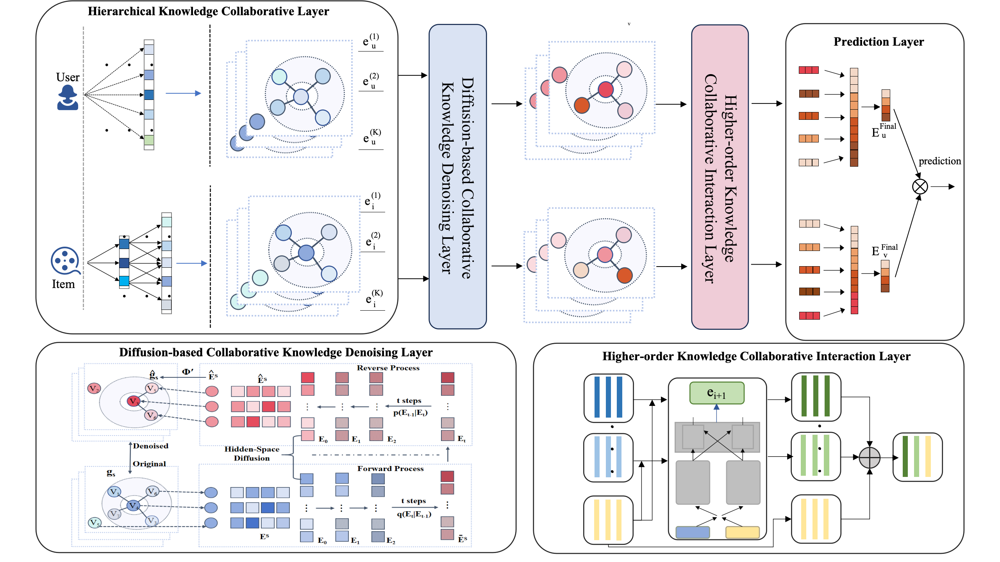

# DDHKI: Diffusion Denoising-based Higher-Order Knowledge Interaction Recommender

This repository contains the official PyTorch implementation for the paper:
**"DDHKI: Diffusion Denoising-based Higher-Order Knowledge Interaction Recommender"**
(Submitted to ISWC 2025)

## Abstract
*(You can add a brief abstract of your paper here later)*

## Environment Setup

The code has been tested with the following environment:

*   Python: `3.8.18`
*   PyTorch: `2.0.0+cu118`
*   CUDA: `11.8`

**Recommended Setup:**

1.  Create a virtual environment (e.g., using conda):
    ```bash
    conda create -n ddhki python=3.8
    conda activate ddhki
    ```

2.  Install PyTorch with CUDA 11.8 support:
    ```bash
    pip install torch==2.0.0+cu118 torchvision==0.15.1+cu118 torchaudio==2.0.1 --index-url https://download.pytorch.org/whl/cu118
    ```
    (Adjust `torchvision` and `torchaudio` versions if needed, or omit if not used directly by your core logic.)

3.  Install other necessary packages. It's highly recommended to create a `requirements.txt` file. Based on typical KG-based recommendation models, you might need:
    ```bash
    pip install numpy pandas scipy tqdm scikit-learn
    # Add any other specific libraries your project uses
    ```
    You can generate a `requirements.txt` file from your working environment using:
    ```bash
    pip freeze > requirements.txt
    ```
    Then users can install all dependencies with:
    ```bash
    pip install -r requirements.txt
    ```

## Running the Code

You can directly run the experiments using the provided shell script:

```bash
sh run.sh
```

**Customizing Runs:**

The `run.sh` script likely calls `main.py` with specific arguments. You can modify `run.sh` or `main.py` directly to change configurations, such as the dataset.

For example, to change the dataset:
*   **Option 1: Modify `run.sh`**
    Open `run.sh` and find the line that executes `main.py`. Change the `--dataset` argument.
    ```bash
    # Example content of run.sh
    # For Last.FM (default)
    # python main.py --dataset lastfm ... other_args ...

    # To run on Book-Crossing
    # python main.py --dataset book ... other_args ...

    # To run on MovieLens-20M
    # python main.py --dataset movie ... other_args ...
    ```
    Make sure only one execution line is uncommented when you run `sh run.sh`.

*   **Option 2: Directly call `main.py` (Refer to `main.py` for all available arguments)**
    ```bash
    python main.py --dataset book [other arguments as defined in main.py]
    python main.py --dataset movie [other arguments as defined in main.py]
    ```

Please refer to `main.py` (e.g., using `python main.py --help`) to see the full list of configurable parameters.


## Model Architecture

The architecture of DDHKI is illustrated below:




## Performance

The performance of DDHKI compared to baselines on three benchmark datasets is as follows:

| Model       | Last.FM AUC     | Last.FM F1      | Book-Crossing AUC | Book-Crossing F1  | MovieLens-20M AUC | MovieLens-20M F1 |
|-------------|-----------------|-----------------|-------------------|-------------------|-------------------|------------------|
| CKE         | 0.747           | 0.674           | 0.676             | 0.623             | 0.927             | 0.874            |
| PER         | 0.721           | 0.683           | 0.701             | 0.693             | 0.931             | 0.894            |
| RippleNet   | 0.776           | 0.702           | 0.721             | 0.647             | 0.976             | 0.927            |
| KGCN        | 0.812           | 0.711           | 0.694             | 0.641             | 0.964             | 0.928            |
| KGAT        | 0.826           | 0.742           | 0.731             | 0.654             | 0.971             | 0.927            |
| KGNN-LS     | 0.813           | 0.728           | 0.669             | 0.628             | 0.974             | 0.923            |
| CKAN        | 0.842           | 0.769           | 0.753             | 0.673             | 0.976             | 0.924            |
| KGIN        | 0.847           | 0.770           | 0.759             | 0.674             | 0.975             | 0.925            |
| KGCL        | 0.845           | 0.769           | 0.748             | 0.665             | 0.974             | 0.924            |
| KACL        | 0.851           | 0.768           | 0.761             | 0.674             | 0.976             | 0.926            |
| DiffRec     | 0.865           | 0.775           | 0.771             | 0.675             | 0.978             | 0.928            |
| **DDHKI**   | **0.880**       | **0.781**       | **0.782**         | **0.676**         | **0.981**         | **0.931**        |


